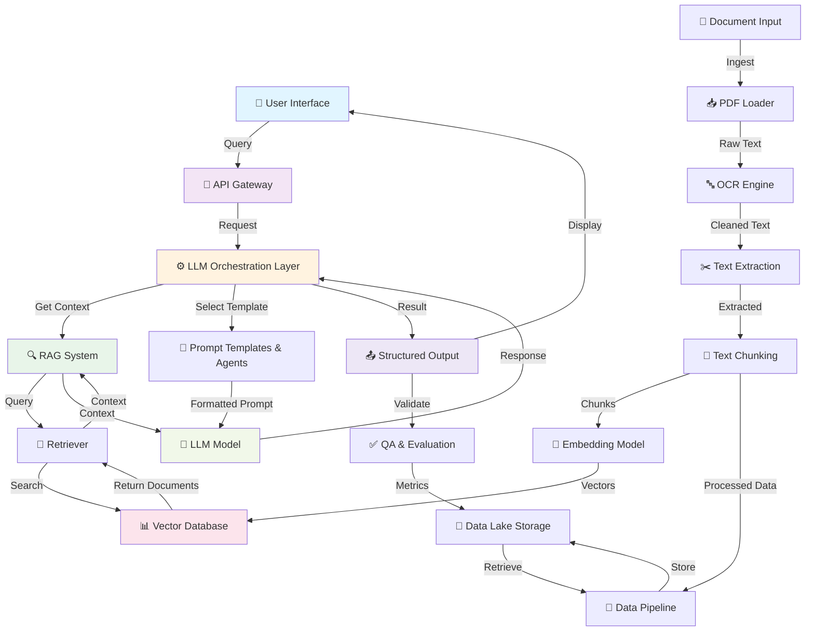

# GeoLLM Architecture Overview

This document provides a comprehensive overview of the GeoLLM-Report-Interpreter system architecture, illustrating the data flow, components, and interactions between different modules.

## System Architecture Diagram

## Component Breakdown

### 📥 Input Layer
- **Document Input**: Raw geotechnical documents (PDFs, scanned boring logs, lab reports)
- **PDF Loader**: Extracts raw text from PDF files
- **OCR Engine**: Processes scanned documents and images
- **Text Extraction**: Cleans and extracts meaningful content from raw text

### 🔗 Processing Layer
- **Text Chunking**: Divides documents into semantically meaningful chunks
- **Data Pipeline**: Orchestrates data transformation and validation
- **Storage**: Persists processed data in Data Lake

### 🧮 Embedding & Vectorization
- **Embedding Model**: Converts text chunks into vector embeddings using domain-specific models
- **Vector Database**: Stores and indexes embeddings for fast retrieval (e.g., FAISS, Pinecone, Weaviate)

### 🔍 Retrieval Layer (RAG)
- **Retriever**: Performs similarity search against vector database
- **Context Selection**: Retrieves top-k relevant documents for a given query
- **Relevance Ranking**: Ranks retrieved documents by relevance score

### ⚙️ LLM Orchestration
- **Prompt Templates**: Domain-specific prompts for geotechnical analysis
- **Agent Logic**: Manages multi-step reasoning and tool use
- **LLM Interface**: Communicates with external LLM APIs (OpenAI, Anthropic, etc.)

### 🤖 LLM Inference
- **Model Serving**: Hosts or connects to language models
- **Inference Engine**: Processes prompts and generates structured outputs
- **Output Parsing**: Converts raw LLM output to structured formats (JSON, Pydantic)

### 📤 Output Layer
- **Structured Output**: Returns results in defined schemas (JSON, extracted entities)
- **QA & Evaluation**: Validates outputs against ground truth and metrics
- **User Interface**: Delivers results via API, Web UI, or Chatbot

## Data Flow

1. **Ingestion**: User uploads geotechnical documents
2. **Processing**: Documents are parsed, cleaned, and chunked
3. **Embedding**: Text chunks are converted to vector embeddings
4. **Storage**: Embeddings stored in vector database; processed data in data lake
5. **Query**: User submits a question or request
6. **Retrieval**: System retrieves relevant document chunks via similarity search
7. **Generation**: LLM generates response using retrieved context and prompt templates
8. **Output**: Structured result is returned to user and validated

## Key Technologies

| Component | Technology Stack |
|-----------|------------------|
| LLM Framework | LangChain, LlamaIndex |
| Embedding Models | OpenAI Embeddings, HuggingFace Transformers |
| Vector Database | FAISS, Pinecone, Weaviate, Milvus |
| PDF Processing | PyPDF2, pdfplumber, Tesseract |
| Data Processing | Pandas, NumPy, Polars |
| API Framework | FastAPI, Flask |
| Frontend | Streamlit, React |
| Schema Validation | Pydantic |
| Testing | pytest, unittest |

## Scalability Considerations

- **Horizontal Scaling**: Vector database and LLM serving can scale independently
- **Batch Processing**: Handle large document ingestion via asynchronous pipelines
- **Caching**: Cache embeddings and retrieval results for frequently accessed documents
- **Distributed Inference**: Use load balancing for multiple LLM inference instances

## Security & Privacy

- API keys stored in environment variables (never committed)
- User queries logged separately from sensitive document content
- Optional encryption for data at rest and in transit
- Access control via API keys and authentication tokens

## Future Enhancements

- Fine-tuning LLM on geotechnical-specific datasets
- Implementing multi-modal analysis (combining text with bore logs, geological maps)
- Real-time monitoring and performance analytics
- Integration with geotechnical software (GIS systems, analysis tools)
- Multi-language support for international geotechnical standards
